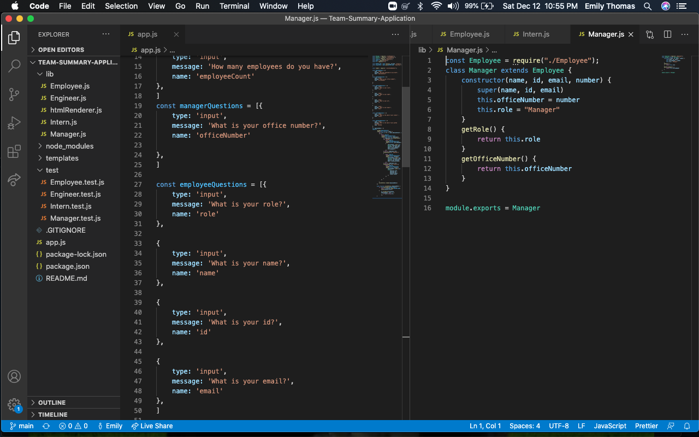

# Welcome to my Team Summary Application!

## Description 
I have made an app for a company to use to organize their employees data!  This was really fun to make and really pushed me to test my skills with JavaScript.  This app will prompt employees to answer questions based on their role within the company.  It will then store the data and push it to an html so managers have access to all employee data.
 
 

## Installation
Install node.js and run npm install in the package directory

## Usage
Run node . in the package directory

## License
MIT
